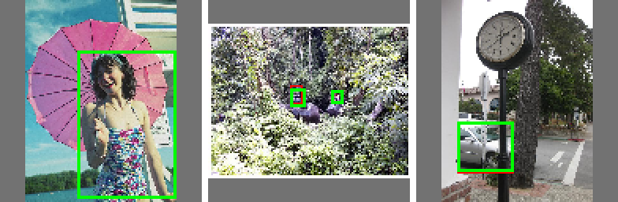

# yolov5_cpp

C++ (LibTorch) 実装の **YOLOv5 学習＋推論**。PyTorch版 Ultralytics YOLOv5 の学習パイプラインを
C++ に移植したもの。学習の中身（モデル・損失・アンカーマッチング・逆伝播）を C++ で追える教材であり、
小〜中規模データなら実用的にも学習を回せる。

さらに `scratch/` には、**外部依存ゼロ（標準ライブラリのみ）で autograd から自作**した
mini-YOLOv5 を収録（下記画像はその検出結果）。



*依存ゼロ・自作autogradの mini-YOLOv5 が実写の人・車を検出（緑=検出, 赤=GT）。詳細は [`scratch/README.md`](scratch/README.md)。*

## 構成

```
src/
  model/modules.h     Conv / Bottleneck / C3 / SPPF   （models/common.py 相当）
  model/yolov5.*      backbone + PAN head + Detect     （YOLOv5n を C++ で組み立て）
  loss/loss.*         build_targets + CIoU + BCE       （ComputeLoss の移植）
  data/dataset.*      YOLO形式ローダ + letterbox + 拡張
  data/image_io.*     stb_image による画像入出力（外部依存なし）
  utils.*             NMS / xywh2xyxy / 矩形描画
  train.cpp           学習ループ（warmup + cosine LR + EMA + checkpoint）
  detect.cpp          推論（decode + NMS + 可視化）
  gen_data.cpp        合成データ生成（動作確認用）
  main.cpp            CLI
```

依存は **LibTorch 2.5.1 (CPU)** のみ。画像IOは同梱の stb_image を使うため OpenCV は不要
（あれば CMake が自動検出）。

## ビルド

```powershell
# LibTorch は C:\prog\vc\third_party\libtorch に展開済み前提
# （プロジェクト外に置くことで yolov5_cpp を zip しても含まれない）
powershell -ExecutionPolicy Bypass -File build.ps1
# => build/Release/yolov5.exe
```

> LibTorch(CPU 2.5.1) は次で取得し `C:\prog\vc\third_party\libtorch` に展開:
> `https://download.pytorch.org/libtorch/cpu/libtorch-win-shared-with-deps-2.5.1%2Bcpu.zip`
> stb ヘッダも `C:\prog\vc\third_party\stb` に置く。別の場所なら
> `cmake ... -DCMAKE_PREFIX_PATH=<path>/libtorch` で上書き可。

## 使い方

### 1. 動作確認（合成データで学習→推論）

```powershell
# 3クラス（赤/緑/青の矩形）の合成データを生成
build/Release/yolov5.exe gen-data --out data/synthetic --num-train 64 --num-val 16 --imgsz 320

# 学習
build/Release/yolov5.exe train --images data/synthetic/images/train --nc 3 `
    --epochs 30 --batch 8 --imgsz 320 --out runs

# 推論（学習済み重みで検出＋可視化PNG出力）
build/Release/yolov5.exe detect --weights runs/best.pt --nc 3 `
    --source data/synthetic/images/val/img_0000.png --imgsz 320 --out pred.png
```

### 2. 自前データで学習

Ultralytics と同じレイアウト（`images/` と `labels/` を対にし、ラベルは
`class cx cy w h`（0〜1正規化）1行1物体）:

```
mydata/
  images/train/*.jpg
  labels/train/*.txt   # 画像と同名 .txt
```

```powershell
build/Release/yolov5.exe train --images mydata/images/train --nc <クラス数> --epochs 100 --batch 16 --imgsz 640
```

`--labels DIR` で明示指定も可。省略時はパス中の `images` を `labels` に置換して探す。

### 3. ONNX エクスポート（Pythonブリッジ）

LibTorch(C++) には ONNX エクスポータが無いため、学習済み重みを Python へ渡して変換する。

```powershell
# 依存（初回のみ）: CPU版torch + onnx + onnxruntime
python -m pip install torch onnx onnxruntime --index-url https://download.pytorch.org/whl/cpu

# (1) C++で重みを可搬形式(weights.bin)へ書き出し
build/Release/yolov5.exe export-weights --weights runs/best.pt --nc 3 --out weights.bin

# (2) 同一構造のPyTorchモデルへ読み込み→ONNX化
python tools/export_onnx.py --weights weights.bin --nc 3 --imgsz 320 --out model.onnx
```

`tools/export_onnx.py` は `src/model/` と**同じ層名**で PyTorch 版 YOLOv5n を再構築するため、
`state_dict` のキーが完全一致し `missing 0 / unexpected 0` で読み込める。出力 ONNX は
デコード済み `(batch, N, nc+5)` を返し、PyTorch出力との数値誤差は ~2e-4。

### 4. 公式Ultralytics重みの取り込み（official .pt → C++で推論）

公式の学習済み `yolov5n.pt` をこのC++版で使える。アーキは公式と厳密一致（全349テンソルが
過不足なく対応）なので、層名を対応付けて変換するだけ。yolov5リポジトリは不要
（スタブモジュールで公式チェックポイントを逆pickleしテンソルのみ抽出）。

```powershell
# 公式重みを取得
curl -L -o yolov5n.pt https://github.com/ultralytics/yolov5/releases/download/v7.0/yolov5n.pt

# (1) 公式.pt -> 可搬bin（層名を model.N -> conv0/c3_2/... に対応付け）
python tools/convert_ultralytics.py --pt yolov5n.pt --out weights_official.bin

# (2) bin -> C++が読める .pt
build/Release/yolov5.exe import-weights --in weights_official.bin --nc 80 --out yolov5n_cpp.pt

# (3) 推論（COCO 80クラス）
build/Release/yolov5.exe detect --weights yolov5n_cpp.pt --nc 80 --source bus.jpg --imgsz 640 --out pred.png
```

検証済み：`bus.jpg` で person×4 + bus×1 を正しく検出（公式YOLOv5nと同じ結果）。
逆方向（C++学習重み → 公式形式）は `export-weights` + 変換の逆マッピングで可能。

## 実装メモ（学習ポイント）

- **Conv = Conv2d(bias無) → BatchNorm → SiLU**。C3 は CSP 構造、SPPF は maxpool 3段。
- **Detect**：各スケールで `1x1 Conv → (bs, na, ny, nx, nc+5)`。stride はダミー入力の
  forward から自動算出し、アンカーを grid 単位へ変換。
- **損失**：`build_targets` で各 GT を近傍セル（±0.5）へ複製し、アンカー比 <4 でマッチング。
  box は CIoU、obj は IoU を教師にした BCE、cls は BCE。
- **学習**：SGD(momentum=0.937, nesterov) + 線形warmup + cosine減衰 + EMA。
  `best.pt` は EMA重み、`last.pt` は生重み。

## フルスクラッチ版（`scratch/`）

外部依存ゼロ（標準ライブラリのみ）で **autograd から自作**した学習用YOLOを `scratch/` に用意。
LibTorchすら使わず、テンソル・計算グラフ・逆伝播・conv/pool・損失・SGD・NMSを全て手書き。
数値微分による勾配チェックで正しさを検証済み。詳細は `scratch/README.md`。

```powershell
cd scratch && cmake -S . -B build -G "Visual Studio 17 2022" -A x64 && cmake --build build --config Release
build/Release/scratch_yolo.exe          # 勾配チェック
build/Release/scratch_yolo.exe train    # 学習→検出
```

## 制限・拡張余地

- CPU 前提（CUDA版 LibTorch に差し替えれば GPU 学習も可。コードは device 自動判定済み）。
- 拡張は水平反転＋明度ジッタのみ（mosaic / mixup は未実装＝拡張ポイント）。
- mAP 評価は未実装（val 推論で目視確認）。
```
